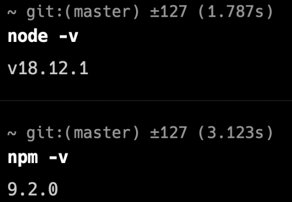
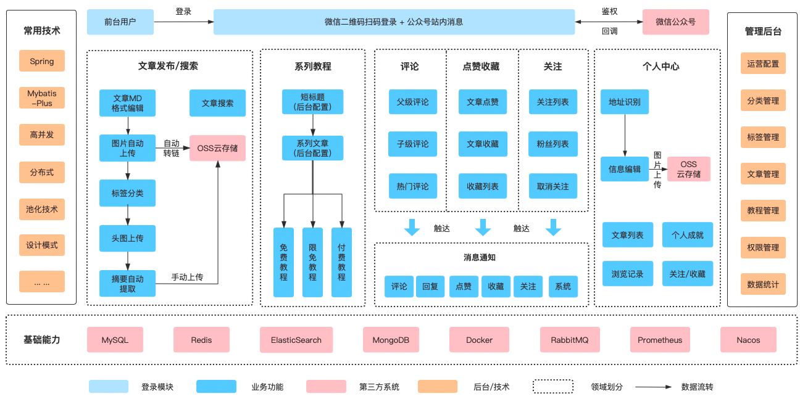

## benben

一个基于 Spring Boot、MyBatis-Plus、MySQL、Redis、ElasticSearch、MongoDB、Docker、RabbitMQ 等技术栈实现的社区服务系统

基于 React18、React-Router v6、React-Hooks、Redux、TypeScript、Vite3、Ant-Design 5.x、Hook Admin、ECharts 的一套社区服务系统

采用最新技术找开发：React18、React-Router v6、React-Hooks、TypeScript、Vite3

采用 Vite3 作为项目开发、打包工具（配置了 Gzip 打包、跨域代理、打包预览工具……）

集成了 TypeScript，使用 redux 做状态管理，集成 immer、react-redux、redux-persist 开发

使用 TypeScript 对 Axios 整个二次封装 （全局错误拦截、常用请求封装、全局请求 Loading、取消重复请求……）

支持 Antd 组件大小切换、暗黑 && 灰色 && 色弱模式，使用 自定义高阶组件 进行路由权限拦截（403 页面）、页面按钮权限配置

支持 React-Router v6 路由懒加载配置、菜单手风琴模式、无限级菜单、多标签页、面包屑导航

使用 Prettier 统一格式化代码，集成 Eslint、Stylelint 代码校验规范（项目规范配置）

使用 husky、lint-staged、commitlint、commitizen、cz-git 规范提交信息（项目规范配置）

npm install -g cnpm -registry https://registry.npmmirror.com

npm run dev



```
# 生产环境
npm run build:pro
```

## 二、项目介绍

### 架构图

#### 系统架构图



#### 业务架构图

前台

- 首页门户
- 文章浏览
- 文章编辑
- 文章搜索
- 系列教程
- 登录鉴权
- 用户评论
- 点赞收藏
- 个人中心
- 消息通知
- 广告运营
- 粉丝管理

后台

- 数据统计
- 运营配置
- 分类管理
- 标签管理
- 文章管理
- 教程配置
- 教程文章
- 权限管理

### 组织结构

```
benben
├── benben-api -- 定义一些通用的枚举、实体类，定义 DO\DTO\VO 等
├── benben-core -- 核心工具/组件相关模块，如工具包 util， 通用的组件都放在这个模块（以包路径对模块功能进行拆分，如搜索、缓存、推荐等）
├── benben-service -- 服务模块，业务相关的主要逻辑，DB 的操作都在这里
├── benben-ui -- HTML 前端资源（包括 JavaScript、CSS、Thymeleaf 等）
├── benben-web -- Web模块、HTTP入口、项目启动入口，包括权限身份校验、全局异常处理等
```

#### 环境配置说明

资源配置都放在 `benben-web` 模块的资源路径下，通过maven的env进行环境选择切换

当前提供了四种开发环境

- resources-env/dev: 本地开发环境，也是默认环境
- resources-env/test: 测试环境
- resources-env/pre: 预发环境
- resources-env/prod: 生产环境

环境切换命令

```bash
# 如切换生产环境
mvn clean install -DskipTests=true -Pprod
```

#### 配置文件说明

- resources
  - application.yml: 主配置文件入口
  - application-config.yml: 全局的站点信息配置文件
  - logback-spring.xml: 日志打印相关配置文件
  - liquibase: 由liquibase进行数据库表结构管理
- resources-env
  - xxx/application-dal.yml: 定义数据库相关的配置信息
  - xxx/application-image.yml: 定义上传图片的相关配置信息
  - xxx/application-web.yml: 定义web相关的配置信息

#### [前端工程结构说明]

- 分类文章列表页面
- 对应文章详情页:文章详情，左边的点赞/收藏/评论浮窗,文章详情右边侧边栏的sidebar
- 对应文章发布页
- 对应文章搜索页
- 对应标签文章列表
- 对应专栏阅读详情页
- 对应专栏首页
- 全站主页
- 登录页面
- 用户个人页
- 通知页面

### 技术选型

后端技术栈

|         技术          | 说明                   | 官网                                                                                                 |
|:-------------------:|----------------------|----------------------------------------------------------------------------------------------------|
| Spring & SpringMVC  | Java全栈应用程序框架和WEB容器实现 | [https://spring.io/](https://spring.io/)                                                           |
|     SpringBoot      | Spring应用简化集成开发框架     | [https://spring.io/projects/spring-boot](https://spring.io/projects/spring-boot)                   |
|       mybatis       | 数据库orm框架             | [https://mybatis.org](https://mybatis.org)                                                       |
|    mybatis-plus     | 数据库orm框架             | [https://baomidou.com/](https://baomidou.com/)                                                     |
| mybatis PageHelper  | 数据库翻页插件              | [https://github.com/pagehelper/Mybatis-PageHelper](https://github.com/pagehelper/Mybatis-PageHelper) |
|    elasticsearch    | 近实时文本搜索              | [https://www.elastic.co/cn/elasticsearch/service](https://www.elastic.co/cn/elasticsearch/service) |
|        redis        | 内存数据存储               | [https://redis.io](https://redis.io)                                                               |
|      rabbitmq       | 消息队列                 | [https://www.rabbitmq.com](https://www.rabbitmq.com)                                               |
|       mongodb       | NoSql数据库             | [https://www.mongodb.com/](https://www.mongodb.com/)                                               |
|        nginx        | 服务器                  | [https://nginx.org](https://nginx.org)                                                             |
|       docker        | 应用容器引擎               | [https://www.docker.com](https://www.docker.com)                                                   |
|      hikariCP       | 数据库连接                | [https://github.com/brettwooldridge/HikariCP](https://github.com/brettwooldridge/HikariCP)         |
|         oss         | 对象存储                 | [https://help.aliyun.com/document_detail/31883.html](https://help.aliyun.com/document_detail/31883.html)                                               |
|        https        | 证书                   | [https://letsencrypt.org/](https://letsencrypt.org/)                                               |
|         jwt         | jwt登录                | [https://jwt.io](https://jwt.io)                                                                   |
|       lombok        | Java语言增强库            | [https://projectlombok.org](https://projectlombok.org)                                             |
|        guava        | google开源的java工具集     | [https://github.com/google/guava](https://github.com/google/guava)                                 |
|      thymeleaf      | html5模板引擎            | [https://www.thymeleaf.org](https://www.thymeleaf.org)                                             |
|       swagger       | API文档生成工具            | [https://swagger.io](https://swagger.io)                                                           |
| hibernate-validator | 验证框架                 | [hibernate.org/validator/](hibernate.org/validator/)                                               |
|     quick-media     | 多媒体处理                | [https://github.com/liuyueyi/quick-media](https://github.com/liuyueyi/quick-media)                 |
|      liquibase      | 数据库版本管理              | [https://www.liquibase.com](https://www.liquibase.com)                                             |
|       jackson       | json/xml处理           | [https://www.jackson.com](https://www.jackson.com)                                                 |
|      ip2region      | ip地址                 | [https://github.com/zoujingli/ip2region](https://github.com/zoujingli/ip2region)                   |
|      websocket      | 长连接                  | [https://docs.spring.io/spring/reference/web/websocket.html](https://docs.spring.io/spring/reference/web/websocket.html)                   |
|      sensitive-word      | 敏感词                  | [https://github.com/houbb/sensitive-word](https://github.com/houbb/sensitive-word)                   |
|       chatgpt       | chatgpt              | [https://openai.com/blog/chatgpt](https://openai.com/blog/chatgpt)                   |
|        讯飞星火         | 讯飞星火大模型              | [https://www.xfyun.cn/doc/spark/Web.html](https://www.xfyun.cn/doc/spark/Web.html#_1-%E6%8E%A5%E5%8F%A3%E8%AF%B4%E6%98%8E)                   |

## 四、环境搭建

### 开发工具

|        工具        | 说明           | 官网                                                                                                           | 
|:----------------:|--------------|--------------------------------------------------------------------------------------------------------------|
|       IDEA       | java开发工具     | [https://www.jetbrains.com](https://www.jetbrains.com)                                                       |
|     Webstorm     | web开发工具      | [https://www.jetbrains.com/webstorm](https://www.jetbrains.com/webstorm)                                     |
|      Chrome      | 浏览器          | [https://www.google.com/intl/zh-CN/chrome](https://www.google.com/intl/zh-CN/chrome)                         |
|   ScreenToGif    | gif录屏        | [https://www.screentogif.com](https://www.screentogif.com)                                                   |
|     SniPaste     | 截图           | [https://www.snipaste.com](https://www.snipaste.com)                                                         |
|     PicPick      | 图片处理工具       | [https://picpick.app](https://picpick.app)                                                                   |
|     MarkText     | markdown编辑器  | [https://github.com/marktext/marktext](https://github.com/marktext/marktext)                                 |
|       curl       | http终端请求     | [https://curl.se](https://curl.se)                                                                           |
|     Postman      | API接口调试      | [https://www.postman.com](https://www.postman.com)                                                           |
|     draw.io      | 流程图、架构图绘制    | [https://www.diagrams.net/](https://www.diagrams.net/)                                                       |
|      Axure       | 原型图设计工具      | [https://www.axure.com](https://www.axure.com)                                                     |
|     navicat      | 数据库连接工具      | [https://www.navicat.com](https://www.navicat.com)                                                           |
|     DBeaver      | 免费开源的数据库连接工具 | [https://dbeaver.io](https://dbeaver.io)                                                                     |
|      iTerm2      | mac终端        | [https://iterm2.com](https://iterm2.com)                                                                     |
| windows terminal | win终端        | [https://learn.microsoft.com/en-us/windows/terminal/install](https://learn.microsoft.com/en-us/windows/terminal/install) |
|   SwitchHosts    | host管理       | [https://github.com/oldj/SwitchHosts/releases](https://github.com/oldj/SwitchHosts/releases)                 |


### 开发环境

|      工具       | 版本        | 下载                                                                                                                     |
|:-------------:|:----------|------------------------------------------------------------------------------------------------------------------------|
|      jdk      | 1.8+      | [https://www.oracle.com/java/technologies/downloads/#java8](https://www.oracle.com/java/technologies/downloads/#java8) |
|     maven     | 3.4+      | [https://maven.apache.org/](https://maven.apache.org/)                                                                 |
|     mysql     | 5.7+/8.0+ | [https://www.mysql.com/downloads/](https://www.mysql.com/downloads/)                                                   |
|     redis     | 5.0+      | [https://redis.io/download/](https://redis.io/download/)                                                               |
| elasticsearch | 8.0.0+    | [https://www.elastic.co/cn/downloads/elasticsearch](https://www.elastic.co/cn/downloads/elasticsearch)                 |
|     nginx     | 1.10+     | [https://nginx.org/en/download.html](https://nginx.org/en/download.html)                                               |
|   rabbitmq    | 3.10.14+  | [https://www.rabbitmq.com/news.html](https://www.rabbitmq.com/news.html)                                               |
|    ali-oss    | 3.15.1    | [https://help.aliyun.com/document_detail/31946.html](https://help.aliyun.com/document_detail/31946.html)               |
|      git      | 2.34.1    | [http://github.com/](http://github.com/)                                                                               |
|    docker     | 4.10.0+   | [https://docs.docker.com/desktop/](https://docs.docker.com/desktop/)                                                   |
| let's encrypt | https证书   | [https://letsencrypt.org/](https://letsencrypt.org/)                                                                   |

admin目录

```
benben-admin
├─ .vscode                # vscode推荐配置
├─ public                 # 静态资源文件（忽略打包）
├─ src
│  ├─ api                 # API 接口管理
│  ├─ assets              # 静态资源文件
│  ├─ components          # 全局组件
│  ├─ config              # 全局配置项
│  ├─ enums               # 项目枚举
│  ├─ hooks               # 常用 Hooks
│  ├─ language            # 语言国际化
│  ├─ layouts             # 框架布局
│  ├─ routers             # 路由管理
│  ├─ redux               # redux store
│  ├─ styles              # 全局样式
│  ├─ typings             # 全局 ts 声明
│  ├─ utils               # 工具库
│  ├─ views               # 项目所有页面
│  ├─ App.tsx             # 入口页面
│  ├─ main.tsx            # 入口文件
│  └─ env.d.ts            # vite 声明文件
├─ .editorconfig          # 编辑器配置（格式化）
├─ .env                   # vite 常用配置
├─ .env.development       # 开发环境配置
├─ .env.production        # 生产环境配置
├─ .env.test              # 测试环境配置
├─ .eslintignore          # 忽略 Eslint 校验
├─ .eslintrc.js           # Eslint 校验配置
├─ .gitignore             # git 提交忽略
├─ .prettierignore        # 忽略 prettier 格式化
├─ .prettierrc.js         # prettier 配置
├─ .stylelintignore       # 忽略 stylelint 格式化
├─ .stylelintrc.js        # stylelint 样式格式化配置
├─ CHANGELOG.md           # 项目更新日志
├─ commitlint.config.js   # git 提交规范配置
├─ index.html             # 入口 html
├─ LICENSE                # 开源协议文件
├─ lint-staged.config     # lint-staged 配置文件
├─ package-lock.json      # 依赖包包版本锁
├─ package.json           # 依赖包管理
├─ postcss.config.js      # postcss 配置
├─ README.md              # README 介绍
├─ tsconfig.json          # typescript 全局配置
└─ vite.config.ts         # vite 配置
```

将 dist 目录上传到服务器的 /home/admin/ 目录下

```
location ^~ /admin {
	alias /home/admin/dist/; # 根 目 录
	index index.html;
}
```

## 亮点

mysql同步es，支持es查询集成

### 搭建步骤

#### 本地部署教程


### 云服务器部署教程

