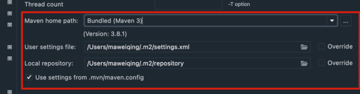
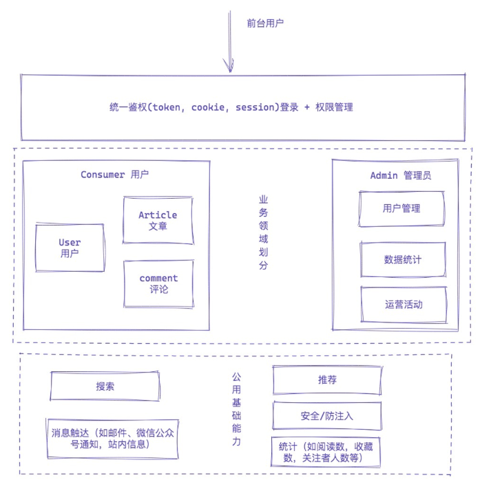
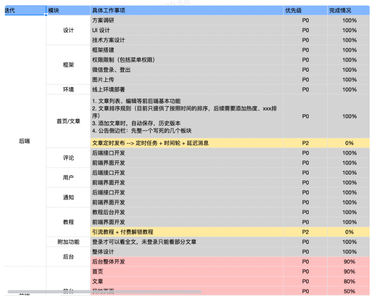
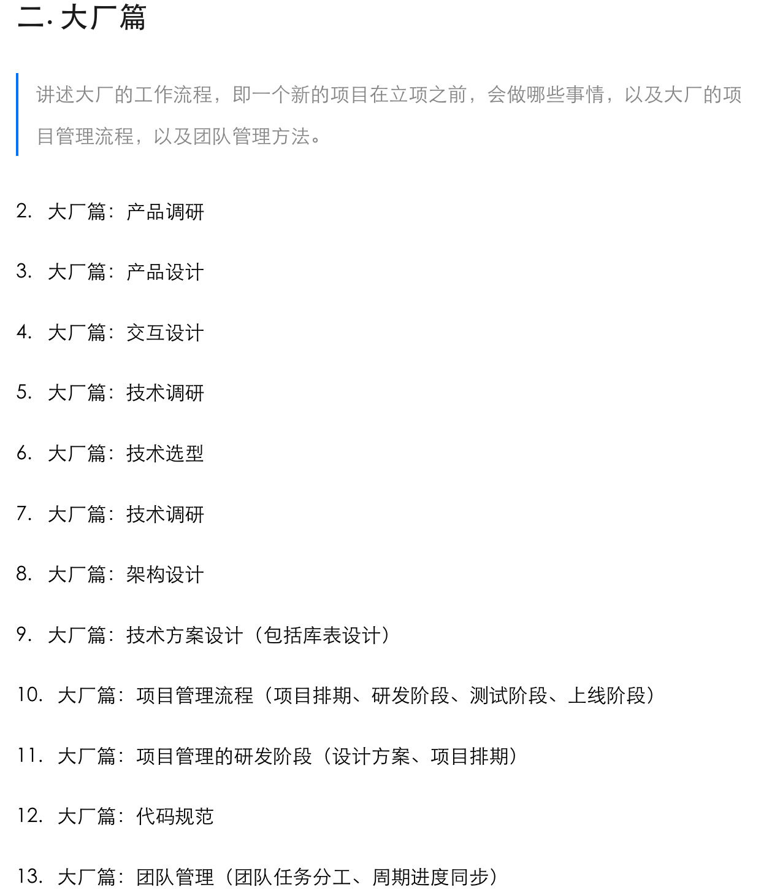
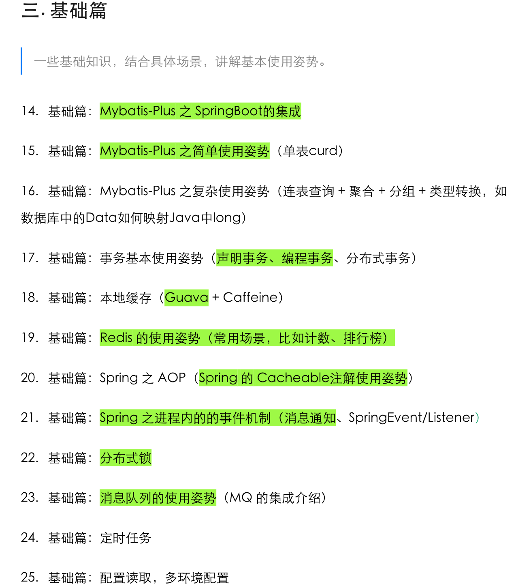
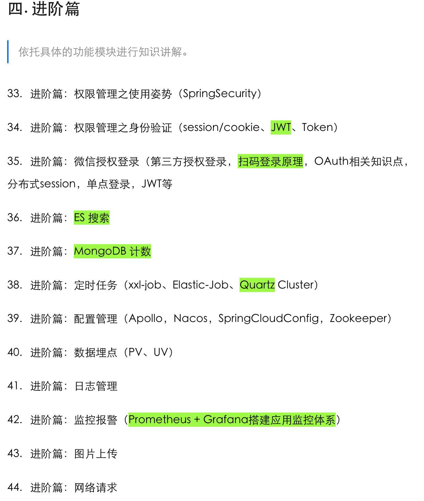

## benben

一个基于 Spring Boot、MyBatis-Plus、MySQL、Redis、ElasticSearch、MongoDB、Docker、RabbitMQ 等技术栈实现的社区服务系统

基于 React18、React-Router v6、React-Hooks、Redux、TypeScript、Vite3、Ant-Design 5.x、Hook Admin、ECharts 的一套社区服务系统

采用最新技术找开发：React18、React-Router v6、React-Hooks、TypeScript、Vite3

采用 Vite3 作为项目开发、打包工具（配置了 Gzip 打包、跨域代理、打包预览工具……）

集成了 TypeScript，使用 redux 做状态管理，集成 immer、react-redux、redux-persist 开发

使用 TypeScript 对 Axios 整个二次封装 （全局错误拦截、常用请求封装、全局请求 Loading、取消重复请求……）

支持 Antd 组件大小切换、暗黑 && 灰色 && 色弱模式，使用 自定义高阶组件 进行路由权限拦截（403 页面）、页面按钮权限配置

支持 React-Router v6 路由懒加载配置、菜单手风琴模式、无限级菜单、多标签页、面包屑导航

使用 Prettier 统一格式化代码，集成 Eslint、Stylelint 代码校验规范（项目规范配置）

使用 husky、lint-staged、commitlint、commitizen、cz-git 规范提交信息（项目规范配置）

npm install -g cnpm -registry https://registry.npmmirror.com

npm run dev


```
# 生产环境
npm run build:pro
```

## 二、项目介绍

### 架构图

#### 系统架构图


#### 业务架构图

前台

- 首页门户
- 文章浏览
- 文章编辑
- 文章搜索
- 系列教程
- 登录鉴权
- 用户评论
- 点赞收藏
- 个人中心
- 消息通知
- 广告运营
- 粉丝管理

后台

- 数据统计
- 运营配置
- 分类管理
- 标签管理
- 文章管理
- 教程配置
- 教程文章
- 权限管理

### 组织结构

```
benben
├── benben-api -- 定义一些通用的枚举、实体类，定义 DO\DTO\VO 等
├── benben-core -- 核心工具/组件相关模块，如工具包 util， 通用的组件都放在这个模块（以包路径对模块功能进行拆分，如搜索、缓存、推荐等）
├── benben-service -- 服务模块，业务相关的主要逻辑，DB 的操作都在这里
├── benben-ui -- HTML 前端资源（包括 JavaScript、CSS、Thymeleaf 等）
├── benben-web -- Web模块、HTTP入口、项目启动入口，包括权限身份校验、全局异常处理等
```

#### 环境配置说明

资源配置都放在 `benben-web` 模块的资源路径下，通过maven的env进行环境选择切换

当前提供了四种开发环境

- resources-env/dev: 本地开发环境，也是默认环境
- resources-env/test: 测试环境
- resources-env/pre: 预发环境
- resources-env/prod: 生产环境

环境切换命令

```bash
# 如切换生产环境
mvn clean install -DskipTests=true -Pprod
```

#### 配置文件说明

- resources
  - application.yml: 主配置文件入口
  - application-config.yml: 全局的站点信息配置文件
  - logback-spring.xml: 日志打印相关配置文件
  - liquibase: 由liquibase进行数据库表结构管理
- resources-env
  - xxx/application-dal.yml: 定义数据库相关的配置信息
  - xxx/application-image.yml: 定义上传图片的相关配置信息
  - xxx/application-web.yml: 定义web相关的配置信息

#### [前端工程结构说明]

- 分类文章列表页面
- 对应文章详情页:文章详情，左边的点赞/收藏/评论浮窗,文章详情右边侧边栏的sidebar
- 对应文章发布页
- 对应文章搜索页
- 对应标签文章列表
- 对应专栏阅读详情页
- 对应专栏首页
- 全站主页
- 登录页面
- 用户个人页
- 通知页面

### 技术选型

后端技术栈

|         技术          | 说明                   | 官网                                                                                                 |
|:-------------------:|----------------------|----------------------------------------------------------------------------------------------------|
| Spring & SpringMVC  | Java全栈应用程序框架和WEB容器实现 | [https://spring.io/](https://spring.io/)                                                           |
|     SpringBoot      | Spring应用简化集成开发框架     | [https://spring.io/projects/spring-boot](https://spring.io/projects/spring-boot)                   |
|       mybatis       | 数据库orm框架             | [https://mybatis.org](https://mybatis.org)                                                       |
|    mybatis-plus     | 数据库orm框架             | [https://baomidou.com/](https://baomidou.com/)                                                     |
| mybatis PageHelper  | 数据库翻页插件              | [https://github.com/pagehelper/Mybatis-PageHelper](https://github.com/pagehelper/Mybatis-PageHelper) |
|    elasticsearch    | 近实时文本搜索              | [https://www.elastic.co/cn/elasticsearch/service](https://www.elastic.co/cn/elasticsearch/service) |
|        redis        | 内存数据存储               | [https://redis.io](https://redis.io)                                                               |
|      rabbitmq       | 消息队列                 | [https://www.rabbitmq.com](https://www.rabbitmq.com)                                               |
|       mongodb       | NoSql数据库             | [https://www.mongodb.com/](https://www.mongodb.com/)                                               |
|        nginx        | 服务器                  | [https://nginx.org](https://nginx.org)                                                             |
|       docker        | 应用容器引擎               | [https://www.docker.com](https://www.docker.com)                                                   |
|      hikariCP       | 数据库连接                | [https://github.com/brettwooldridge/HikariCP](https://github.com/brettwooldridge/HikariCP)         |
|         oss         | 对象存储                 | [https://help.aliyun.com/document_detail/31883.html](https://help.aliyun.com/document_detail/31883.html)                                               |
|        https        | 证书                   | [https://letsencrypt.org/](https://letsencrypt.org/)                                               |
|         jwt         | jwt登录                | [https://jwt.io](https://jwt.io)                                                                   |
|       lombok        | Java语言增强库            | [https://projectlombok.org](https://projectlombok.org)                                             |
|        guava        | google开源的java工具集     | [https://github.com/google/guava](https://github.com/google/guava)                                 |
|      thymeleaf      | html5模板引擎            | [https://www.thymeleaf.org](https://www.thymeleaf.org)                                             |
|       swagger       | API文档生成工具            | [https://swagger.io](https://swagger.io)                                                           |
| hibernate-validator | 验证框架                 | [hibernate.org/validator/](hibernate.org/validator/)                                               |
|     quick-media     | 多媒体处理                | [https://github.com/liuyueyi/quick-media](https://github.com/liuyueyi/quick-media)                 |
|      liquibase      | 数据库版本管理              | [https://www.liquibase.com](https://www.liquibase.com)                                             |
|       jackson       | json/xml处理           | [https://www.jackson.com](https://www.jackson.com)                                                 |
|      ip2region      | ip地址                 | [https://github.com/zoujingli/ip2region](https://github.com/zoujingli/ip2region)                   |
|      websocket      | 长连接                  | [https://docs.spring.io/spring/reference/web/websocket.html](https://docs.spring.io/spring/reference/web/websocket.html)                   |
|      sensitive-word      | 敏感词                  | [https://github.com/houbb/sensitive-word](https://github.com/houbb/sensitive-word)                   |
|       chatgpt       | chatgpt              | [https://openai.com/blog/chatgpt](https://openai.com/blog/chatgpt)                   |
|        讯飞星火         | 讯飞星火大模型              | [https://www.xfyun.cn/doc/spark/Web.html](https://www.xfyun.cn/doc/spark/Web.html#_1-%E6%8E%A5%E5%8F%A3%E8%AF%B4%E6%98%8E)                   |

## 四、环境搭建

### 开发工具

|        工具        | 说明           | 官网                                                                                                           | 
|:----------------:|--------------|--------------------------------------------------------------------------------------------------------------|
|       IDEA       | java开发工具     | [https://www.jetbrains.com](https://www.jetbrains.com)                                                       |
|     Webstorm     | web开发工具      | [https://www.jetbrains.com/webstorm](https://www.jetbrains.com/webstorm)                                     |
|      Chrome      | 浏览器          | [https://www.google.com/intl/zh-CN/chrome](https://www.google.com/intl/zh-CN/chrome)                         |
|   ScreenToGif    | gif录屏        | [https://www.screentogif.com](https://www.screentogif.com)                                                   |
|     SniPaste     | 截图           | [https://www.snipaste.com](https://www.snipaste.com)                                                         |
|     PicPick      | 图片处理工具       | [https://picpick.app](https://picpick.app)                                                                   |
|     MarkText     | markdown编辑器  | [https://github.com/marktext/marktext](https://github.com/marktext/marktext)                                 |
|       curl       | http终端请求     | [https://curl.se](https://curl.se)                                                                           |
|     Postman      | API接口调试      | [https://www.postman.com](https://www.postman.com)                                                           |
|     draw.io      | 流程图、架构图绘制    | [https://www.diagrams.net/](https://www.diagrams.net/)                                                       |
|      Axure       | 原型图设计工具      | [https://www.axure.com](https://www.axure.com)                                                     |
|     navicat      | 数据库连接工具      | [https://www.navicat.com](https://www.navicat.com)                                                           |
|     DBeaver      | 免费开源的数据库连接工具 | [https://dbeaver.io](https://dbeaver.io)                                                                     |
|      iTerm2      | mac终端        | [https://iterm2.com](https://iterm2.com)                                                                     |
| windows terminal | win终端        | [https://learn.microsoft.com/en-us/windows/terminal/install](https://learn.microsoft.com/en-us/windows/terminal/install) |
|   SwitchHosts    | host管理       | [https://github.com/oldj/SwitchHosts/releases](https://github.com/oldj/SwitchHosts/releases)                 |


### 开发环境

|      工具       | 版本        | 下载                                                                                                                     |
|:-------------:|:----------|------------------------------------------------------------------------------------------------------------------------|
|      jdk      | 1.8+      | [https://www.oracle.com/java/technologies/downloads/#java8](https://www.oracle.com/java/technologies/downloads/#java8) |
|     maven     | 3.4+      | [https://maven.apache.org/](https://maven.apache.org/)                                                                 |
|     mysql     | 5.7+/8.0+ | [https://www.mysql.com/downloads/](https://www.mysql.com/downloads/)                                                   |
|     redis     | 5.0+      | [https://redis.io/download/](https://redis.io/download/)                                                               |
| elasticsearch | 8.0.0+    | [https://www.elastic.co/cn/downloads/elasticsearch](https://www.elastic.co/cn/downloads/elasticsearch)                 |
|     nginx     | 1.10+     | [https://nginx.org/en/download.html](https://nginx.org/en/download.html)                                               |
|   rabbitmq    | 3.10.14+  | [https://www.rabbitmq.com/news.html](https://www.rabbitmq.com/news.html)                                               |
|    ali-oss    | 3.15.1    | [https://help.aliyun.com/document_detail/31946.html](https://help.aliyun.com/document_detail/31946.html)               |
|      git      | 2.34.1    | [http://github.com/](http://github.com/)                                                                               |
|    docker     | 4.10.0+   | [https://docs.docker.com/desktop/](https://docs.docker.com/desktop/)                                                   |
| let's encrypt | https证书   | [https://letsencrypt.org/](https://letsencrypt.org/)                                                                   |

admin目录

```
benben-admin
├─ .vscode                # vscode推荐配置
├─ public                 # 静态资源文件（忽略打包）
├─ src
│  ├─ api                 # API 接口管理
│  ├─ assets              # 静态资源文件
│  ├─ components          # 全局组件
│  ├─ config              # 全局配置项
│  ├─ enums               # 项目枚举
│  ├─ hooks               # 常用 Hooks
│  ├─ language            # 语言国际化
│  ├─ layouts             # 框架布局
│  ├─ routers             # 路由管理
│  ├─ redux               # redux store
│  ├─ styles              # 全局样式
│  ├─ typings             # 全局 ts 声明
│  ├─ utils               # 工具库
│  ├─ views               # 项目所有页面
│  ├─ App.tsx             # 入口页面
│  ├─ main.tsx            # 入口文件
│  └─ env.d.ts            # vite 声明文件
├─ .editorconfig          # 编辑器配置（格式化）
├─ .env                   # vite 常用配置
├─ .env.development       # 开发环境配置
├─ .env.production        # 生产环境配置
├─ .env.test              # 测试环境配置
├─ .eslintignore          # 忽略 Eslint 校验
├─ .eslintrc.js           # Eslint 校验配置
├─ .gitignore             # git 提交忽略
├─ .prettierignore        # 忽略 prettier 格式化
├─ .prettierrc.js         # prettier 配置
├─ .stylelintignore       # 忽略 stylelint 格式化
├─ .stylelintrc.js        # stylelint 样式格式化配置
├─ CHANGELOG.md           # 项目更新日志
├─ commitlint.config.js   # git 提交规范配置
├─ index.html             # 入口 html
├─ LICENSE                # 开源协议文件
├─ lint-staged.config     # lint-staged 配置文件
├─ package-lock.json      # 依赖包包版本锁
├─ package.json           # 依赖包管理
├─ postcss.config.js      # postcss 配置
├─ README.md              # README 介绍
├─ tsconfig.json          # typescript 全局配置
└─ vite.config.ts         # vite 配置
```

将 dist 目录上传到服务器的 /home/admin/ 目录下

```
location ^~ /admin {
	alias /home/admin/dist/; # 根 目 录
	index index.html;
}
```

## 亮点

mysql同步es，支持es查询集成

### 搭建步骤

## 环境安装

jdk安装

```
# ubuntu
apt install openjdk-8-jdk

# centos
yum install openjdk-8-jdk
```

安装完毕之后，执行 java , javac命令进行验证

maven安装

```
cd ~
mkdir soft
cd soft
wget https://dlcdn.apache.org/maven/maven-3/3.8.6/binaries/apache-maven-3.8.6-bin.tar.gz
tar -zxvf apache-maven-3.8.6-bin.tar.gz

vim ~/.bashrc

# 在最后添加环境变量
export M2_HOME=/home/admin/soft/apache-maven-3.8.6
PATH=M2HOME/bin:M2_HOME/bin:PATH

# 配置生效
source ~/.bashrc
```

配置完成之后执行命令 mvn --version 进行验证

国内添加阿里的镜像源，加快下载速度

```
vim ~/soft/apache-maven-3.8.6/conf/settings.xml

# 在<mirros>标签中，添加下面的镜像源

    <mirror>
      <id>alimaven</id>
      <name>aliyun-maven</name>
      <url>http://maven.aliyun.com/nexus/content/groups/public/</url>
      <mirrorOf>central</mirrorOf>
    </mirror>
```

nginx配置

配置访问域名

```
cd /usr/local/nginx/conf/

vim nginx.conf

# 添加子域名解析，每个域名一个独立的配置文件
# 在http的一级标签中，添加如下一行配置，表示在conf.d文件下的所有conf结尾的文件，都属于我们需要使用的nginx配置信息
include /usr/local/nginx/conf/conf.d/*.conf;
```

添加论坛的域名解析规则

```
vim conf.d/ip.conf


# 内容如下
upstream  ip_host {
    server 127.0.0.1:8080;
}
server {
    server_name ip.hhui.top;

    gzip on;
    gzip_buffers 32 4K;
    gzip_comp_level 6;
    gzip_min_length 100;
    gzip_types application/javascript text/css text/xml;
    gzip_disable "MSIE [1-6]\."; #配置禁用gzip条件，支持正则。此处表示ie6及以下不启用gzip（因为ie低版本不支持）
    gzip_vary on;

    location ~* ^.+\.(ico|gif|jpg|jpeg|png){
        access_log   off;
        expires      1d;
        proxy_pass         http://ip_host;
        proxy_set_header   Host $host;
        proxy_set_header   X-Real-IP $remote_addr;
        proxy_set_header   X-Forwarded-For  $proxy_add_x_forwarded_for;
    }

    location ~* ^.+\.(css|js|txt|xml|swf|wav|pptx) {
        access_log   off;
        expires      1d;
        proxy_pass         http://ip_host;
        proxy_set_header   Host $host;
        proxy_set_header   X-Real-IP $remote_addr;
        proxy_set_header   X-Forwarded-For  $proxy_add_x_forwarded_for;
    }

    location ~* ^.+\.(css|js|txt|xml|swf|wav|pptx) {
        access_log   off;
        expires      10m;
        proxy_pass         http://ip_host;
        proxy_set_header   Host host;proxysetheaderX−Real−IPhost;
        proxy_set_header   X-Real-IP remote_addr;
        proxy_set_header   X-Forwarded-For  proxy_add_x_forwarded_for;
    }

    location / {
        proxy_set_header X-real-ip  $remote_addr;
        proxy_pass http://127.0.0.1:8080/;
        proxy_redirect default;
    }

    listen 443 ssl; # managed by Certbot
    ssl_certificate /usr/local/nginx/conf/conf.d/cert.pem;
    ssl_certificate_key /usr/local/nginx/conf/conf.d/key.pem;
    ssl_stapling on;
    ssl_stapling_verify on;
    resolver 8.8.8.8 8.8.4.4 1.1.1.1 valid=60s;
    resolver_timeout 2s;
}


server {
    if ($host = ip.hhui.top) {
        return 301 https://$host$request_uri;
    } # managed by Certbot


    listen 80;
    server_name ip.hhui.top;
    return 404; # managed by Certbot
}
```

证书使用let's encrypt生成

## 数据库创建

```
# ubuntu
sudo apt-get install mysql-server

# centos
yum install mysql mysql-server mysql-libs
```
### 查询登录密码
```
grep "temporary password" /var/log/mysqld.log

## 输出如下
# A temporary password is generated for root@localhost: xxxx
```

### 密码修改:

使用set password

格式：

```
mysql> set password for 用户名@localhost = password('新密码');
```

例子：

```
mysql> set password for root@localhost = password('123');
```

update 方式

```
mysql> use mysql;

mysql> update user set password=password('123') where user='root' and host='localhost';

mysql> flush privileges;
```

添加用户

```
alter user 'root'@'localhost' identified by 'test';
create user 'test'@'%' IDENTIFIED BY 'test';
```

授予权限

```
# root 方式登录
grant all PRIVILEGES on test.* to 'yihui'@'%' IDENTIFIED by 'test';
flush privileges;
```

本项目在首次启动时，会自动创建数据库 + 表结构，无需额外操作；只是需要修改源码中的生产环境配置

## 配置调整

线上部署时，选择prod环境，因此需要设置对应的数据库相关配置信息

resources-env/prod/application-dal.yml

```
spring:
  datasource:
    url: jdbc:mysql://xxx/ip?useUnicode=true&characterEncoding=UTF-8&useSSL=false&serverTimezone=Asia/Shanghai
    username: xxx
    password: xxx
```

根据实际的情况进行修改

## 启动脚本

基于源码的部署脚本

```
#!/usr/bin/env bash

WEB_PATH="benben-web"
JAR_NAME="benben-web-0.0.1-SNAPSHOT.jar"

# 部署
function start() {
    git pull

    # 杀掉之前的进程
    cat pid.log| xargs -I {} kill {}
    mv ${JAR_NAME} ${JAR_NAME}.bak

    mvn clean install -Dmaven.test.skip=True -Pprod
    cd ${WEB_PATH}
    mvn clean package spring-boot:repackage -Dmaven.test.skip=true -Pprod
    cd -

    mv ${WEB_PATH}/target/${JAR_NAME} ./
    echo "启动脚本：==========="
    echo "nohup java -server -Xms512m -Xmx512m -Xmn512m -XX:NativeMemoryTracking=detail -XX:-OmitStackTraceInFastThrow -jar ${JAR_NAME} > /dev/null 2>&1 &"
    echo "==========="
    nohup java -server -Xms512m -Xmx512m -Xmn512m -XX:NativeMemoryTracking=detail -XX:-OmitStackTraceInFastThrow -jar ${JAR_NAME} > /dev/null 2>&1 &
    echo $! 1> pid.log
}

# 重启
function restart() {
    # 杀掉之前的进程
    cat pid.log| xargs -I {} kill {}
    # 重新启动
    echo "启动脚本：==========="
    echo "nohup java -server -Xms512m -Xmx512m -Xmn512m -XX:NativeMemoryTracking=detail -XX:-OmitStackTraceInFastThrow -jar ${JAR_NAME} > /dev/null 2>&1 &"
    echo "==========="
    nohup java -server -Xmn512m -Xmn512m -Xmn512m -XX:NativeMemoryTracking=detail -XX:-OmitStackTraceInFastThrow -jar ${JAR_NAME} > /dev/null 2>&1 &
    echo $! 1> pid.log
}

if [proxy_add_x_forwarded_for;
    }

    location / {
        proxy_set_header X-real-ip  $remote_addr;
        proxy_pass http://127.0.0.1:8080/;
        proxy_redirect default;
    }

    listen 443 ssl; # managed by Certbot
    ssl_certificate /usr/local/nginx/conf/conf.d/cert.pem;
    ssl_certificate_key /usr/local/nginx/conf/conf.d/key.pem;
    ssl_stapling on;
    ssl_stapling_verify on;
    resolver 8.8.8.8 8.8.4.4 1.1.1.1 valid=60s;
    resolver_timeout 2s;
}


server {
    if ($host = ip.hhui.top) {
        return 301 https://$host$request_uri;
    } # managed by Certbot


    listen 80;
    server_name ip.hhui.top;
    return 404; # managed by Certbot
}
```

启动脚本

基于源码的部署脚本

```
#!/usr/bin/env bash

WEB_PATH="ip-web"
JAR_NAME="ip-web-0.0.1-SNAPSHOT.jar"

# 部署
function start() {
    git pull

    # 杀掉之前的进程
    cat pid.log| xargs -I {} kill {}
    mv ${JAR_NAME} ${JAR_NAME}.bak

    mvn clean install -Dmaven.test.skip=True -Pprod
    cd ${WEB_PATH}
    mvn clean package spring-boot:repackage -Dmaven.test.skip=true -Pprod
    cd -

    mv ${WEB_PATH}/target/${JAR_NAME} ./
    echo "启动脚本：==========="
    echo "nohup java -server -Xms512m -Xmx512m -Xmn512m -XX:NativeMemoryTracking=detail -XX:-OmitStackTraceInFastThrow -jar ${JAR_NAME} > /dev/null 2>&1 &"
    echo "==========="
    nohup java -server -Xms512m -Xmx512m -Xmn512m -XX:NativeMemoryTracking=detail -XX:-OmitStackTraceInFastThrow -jar ${JAR_NAME} > /dev/null 2>&1 &
    echo $! 1> pid.log
}

# 重启
function restart() {
    # 杀掉之前的进程
    cat pid.log| xargs -I {} kill {}
    # 重新启动
    echo "启动脚本：==========="
    echo "nohup java -server -Xms512m -Xmx512m -Xmn512m -XX:NativeMemoryTracking=detail -XX:-OmitStackTraceInFastThrow -jar ${JAR_NAME} > /dev/null 2>&1 &"
    echo "==========="
    nohup java -server -Xmn512m -Xmn512m -Xmn512m -XX:NativeMemoryTracking=detail -XX:-OmitStackTraceInFastThrow -jar ${JAR_NAME} > /dev/null 2>&1 &
    echo $! 1> pid.log
}

if [ # == 0 ]; then
  echo "miss command: start | restart"
elif [ 1==′start′];thenstartelif[1 == 'start' ]; then
  start
elif [ 1 == 'restart' ];then
  restart
else
  echo 'illegal command, support cmd: start | restart'
fi
```

启动命令

```
# 进入项目根目录，执行命令
# chmod +x launch.sh # 若脚本没有执行权限，则取消这行命令的注释，用于添加执行权限
./launch.sh start
```

## 源码方式构建

线上部署时，选择prod环境，因此需要设置对应的数据库相关配置信息

vim 进入 resources-env/prod/application-dal.yml

```
spring:
  datasource:
    url: jdbc:mysql://xxx/ip?useUnicode=true&characterEncoding=UTF-8&useSSL=false&serverTimezone=Asia/Shanghai
    username: xxx
    password: xxx
```

根据实际的情况进行修改ip, 用户名密码

接下来就是编译启动

```
cd benben
./launch.sh start
```

提示：

* 若launch.sh脚本没有执行权限，可以通过命令行 chmod +x launch.sh 添加
* 启动之后，可以发现当前目录下新增一个 pid.log 文件，里面记录的是启动的服务进程号
* 业务日志在当前目录的 logs下
* 请求日志: logs/req-prod.log
* 业务日志: logs/ip-prod.log

1.2. 应用重启

若只是单纯的希望应用重启一下

```
cd /home/admin/workspace/benben

./launch.sh restart
```

1.3. 应用发布

当有新的改动时，若希望重新发布应用，执行下面的命令

```
cd /home/admin/workspace/benben

./launch.sh start
```

2. jar包上传

3. 首先确保服务器配置已准备完毕

接下来确保本地生产环境的数据库等相关配置已更新为正确的配置

然后就是再项目根目录下执行

```
# 打包jar，并上传到服务器，关闭旧的应用，重新启动新的应用
./deploy.sh prod
```

# 编程规范约定

## 1. Controller层

### 1.0 接口层逻辑说明

对于Controller接口层，通常需要做的事情为：

- 传参校验
- service服务类调用，获取各类数据
- 返回结果封装(如异常返回，重定向，写cookie，组装返回的VO对象等)

### 1.1 接口层区分两类：返回数据 + 返回视图

建议：不要将两类接口放在同一个Controller文件中，分开存放

- RestController:
  - 返回json/xml/string格式数据，
  - 放在 rest 包路径下，
  - path路径建议为 `业务/api/xxx`
- ViewController:
  - 返回视图
  - 放在view包路径下
  - path路径为 `业务/view/xxx` 或者 `业务/xxx`

### 1.2 接口拆分，版本管理等

当所有的内容放在一个Controller，会导致接口类的膨胀，因此做好接口的拆分治理非常重要；

推荐的拆分原则：

- 按业务拆分：不同的业务，有自己独立的Controller
- 按读写拆分：读和写拆分两个Controller
- 版本拆分：当一个接口有多个版本管理时（常见于给app提供接口的场景），也可以对于版本管理的接口，按照版本进行分包拆分

## 3.DAO

### 3.1 查询方法签名约定

数据库相关查询方法命名(尽量遵循jpa的策略)

- getXxx: 通常表示查询单条记录
- listXxx: 通常是查询多条记录
- selectXxxByXxx: 类JPA用法，表示根据什么条件查询什么信息，要求签名与实际sql一致
  - 如：selectUserNameByUserId: 根据userId查询userName
  - selectByUserIdIn: 查询userId在给定集合中的数据

更新数据
- updateXxx

删除数据
- removeXxx

与之对应的Service相关方法签名

- queryXxx, findXxx
- 尽量不要使用getXxx, selectXxx

1. 环境准备

2. 首先准备好基础的开发环境，如

jdk/jre: 请安装jdk8+以上版本

maven: 本项目基于maven作为项目管理工具，因此在启动之前请配置好maven相关环境

MySql数据库
版本支持：8.x+

说明：数据库可以使用本机的数据库，也可以使用非本机的（请注意本机能正常访问）

git版本管理

开发工具：建议idea，当然eclipse/vs也没有问题



数据库名配置: ip-web/src/main/resources/application.yml

```
# 默认的数据库名
database:
name: benben
```

本项目提供了自动创建库表的功能，在项目启动之后，当库不存在时，会创建库；当表不存在时，会自动创建表，且会初始化一些测试数据

因此不建议用户自己通过上面的sql进行创建表

* dev: 本地开发环境
* test: 测试环境
* pre: 预发环境
* prod: 生产环境

默认的环境选择是dev，可以通过下面两种方式进行环境切换

case1: 命令切换

```
# 切换到test环境
mvn clean package -DskipTests=true -Ptest
```

case2: idea切换

以默认的dev环境配置为例，首先进入配置文件 application-dal.yml

```
spring:
datasource:
# 数据库名，从配置 database.name 中获取
url: jdbc:mysql://127.0.0.1:3306/${database.name}?useUnicode=true&characterEncoding=UTF-8&useSSL=false&serverTimezone=Asia/Shanghai
username: root
password:
```
上面的数据库中，通常来讲需要修改的有三个

url: 主要修改的就是这个数据库的域名 + 端口号，即将127.0.0.1:3306替换为您实际使用的数据库地址
username: 数据库名
password: 数据库密码

1. 基本功能盘点，演示
2. 架构 + 知识体系

## 设计篇
> 这一节将主要介绍一个成熟的团队，一个新的项目在立项之前，会做哪些事情

1. 产品设计
2. 技术调研
3. 方案设计
  1. 架构设计
  2. 库表设计
  3. 技术选型
4. 项目管理，产品功能按版本拆分，任务拆分，排期，周期进度同步

## 技术实现

0. 代码规范、编码风格、Git工作流程、约定等信息同步
1. 项目工程搭建
2. 结构分层（MVC）
3. DAO层实现
  1. SpringBoot集成Mybatis-Plus
  2. 配合现有的代码实现，介绍Mybatis-Plus的CURD使用姿势，以此讲解db操作相关知识点
  3. db相关知识点:
  - 单表curd使用姿势
  - 复杂姿势：连表查询 + 聚合 + 分组 + 类型转换（如数据库中的Data如何映射Java中long）
  - 事务（声明事务、编程事务） + 分布式事务
  - 其他知识点：如输出sql执行日志 + 数据脱敏 + 悲观锁/乐观锁等 + 分库分表 + 全局唯一递增id方案
4. Service层实现
  1. service主要做具体的业务逻辑，大量引入的技术都在这一层进行应用得体现，所以service的相关内容，可以结合知识点来进行展开
  2. 缓存操作姿势
    1. 本地缓存 Guava + Caffeine
    2. redis缓存
    3. Spring 的 Cacheable注解使用姿势 （基于此可以科普介绍AOP）
  3. ES搜索相关
  4. Redis计数器相关
  5. MongoDB相关
  6. 消息通知
    1. 进程内的Spring的事件机制 SpringEvent/Listener
    2. 进程间的MQ姿势
  7. 定时任务
    1. 进程内的Spring的Schedule
    2. 进程间的xxl-job,Elastic-Job,Quartz Cluster
    3. 自研实现：如系统消息，通知百万用户，如何实现
  8. 分布式锁
5. Web层
  1. Controller基本知识点
    1. 传参 + 返回
    2. RestTemplate 网络请求相关
  2. 用户登录权限管理
    1. 自定义基于AOP实现权限管理
    2. SpringSecurity实现权限管理
    3. session/cookie身份校验, JWT、Token等机制
    4. 分布式会话
  3. 全局异常处理
  4. 日志相关
  5. Thymeleaf渲染引擎
    1. 基本语法
    2. SpEL使用姿势
  6. 文件上传下载
  7. 跨域
6. 通用
  1. 多环境管理(dev, test, pre, pro)
  2. 配置相关
    1. 本地配置，如何取，动态刷新
    2. 集成Apollo，Nacos，SpringCloudConfig，Zookeeper
  3. 大厂应用日志规范
  4. 应用状态信息监控
    1. SpringBootAdmin
    2. prometheus
  5. Swagger接口文档管理
  6. 邮件通知
  7. 序列化

## 亮点

1. SpringSecurity实现的权限管理
2. 第三方授权登录，扫码登录原理，OAuth相关知识点，分布式session，单点登录，JWT等
3. MyBatis/MybatisPlus 系统的教程
4. 参数校验Validate
5. 定时任务的各种方案
6. 网站统计功能(pv, uv)，排行榜，计数
7. 缓存相关
8. 分布式锁的实现方式，使用姿势
9. 消息队列，各种MQ的集成介绍
10. 搜索的知识点ES/Solr
11. ELK搭建日志
12. Prometheus + Grafana搭建应用监控体系
13. AOP/Filter两种实现请求日志打印的方式
14. 全链路监控方案
15. 明文密码改造

## 实战技能

1. jdk8流式用法
2. 使用工具包，提高工作效率
    1. 如idea的各种插件
    2. gauva， hutool，apache 等工具包
    3. 打造自己的工具集
3. 如何写出更好看的代码
4. 池化技术，并发管理
5. 如何在项目中使用合适的设计模式

## 部署

1. 不同环境的部署上线教程
2. jar包部署姿势、war包部署姿势
3. docker部署姿势
4. jenkins自动化部署

## 技术

* 构建工具：后端（Maven、Gradle）、前端（Webpack、Vite）
* 单元测试：Junit
* 开发框架：SpringMVC、Spring、Spring Boot
* Web 服务器：Tomcat、Caddy、Nginx
* 微服务：Spring Cloud
* 数据层：JPA、MyBatis、MyBatis-Plus
* 模板引擎：thymeleaf
* 容器：Docker（镜像仓库服务Harbor、图形化工具Portainer）、k8s、Podman
* 分布式 RPC 框架：Dubbo
* 消息队列：Kafka（图形化工具Eagle）、RocketMQ、RabbitMQ、Pulsar
* 持续集成：Jenkins、Drone
* 压力测试：Jmeter
* 数据库：MySQL（数据库中间件Gaea、同步数据canal、数据库迁移工具Flyway）
* 缓存：Redis（增强模块RedisMod、ORM框架RedisOM）
* nosql：MongoDB
* 对象存储服务：minio
* 日志：Log4j、Logback、SF4J、Log4j2
* 搜索引擎：ES
* 日志收集：ELK（日志采集器Filebeat）、EFK（Fluentd）、LPG（Loki+Promtail+Grafana）
* 大数据：Spark、Hadoop、HBase、Hive、Storm、Flink
* 分布式应用程序协调：Zookeeper
* token 管理：jwt（nimbus-jose-jwt）
* 诊断工具：arthas
* 安全框架：Shiro、SpringSecurity
* 权限框架：Keycloak、Sa-Token
* JSON 处理：fastjson2、Jackson、Gson
* office 文档操作：EasyPoi、EasyExcel
* 文件预览：kkFileView
* 属性映射：mapStruct
* Java硬件信息库：oshi
* Java 连接 SSH 服务器：ganymed
* 接口文档：Swagger-ui、Knife4j、Spring Doc、Torna、YApi
* 任务调度框架：Spring Task、Quartz、PowerJob、XXL-Job
* Git服务：Gogs
* 低代码：LowCodeEngine、Yao、Erupt、magic-api
* API 网关：Gateway、Zuul、apisix
* 数据可视化（Business Intelligence，也就是 BI）：DataEase、Metabase
* 项目文档：Hexo、VuePress
* 应用监控：SpringBoot Admin、Grafana、SkyWalking、Elastic APM
* 注解：lombok
* jdbc连接池：Druid
* Java 工具包：hutool、Guava
* 数据检查：hibernate validator
* 代码生成器：Mybatis generator
* Web 自动化测试：selenium
* HTTP客户端工具：Retrofit
* 脚手架：sa-plus



## 进度排期



## bug&优化









