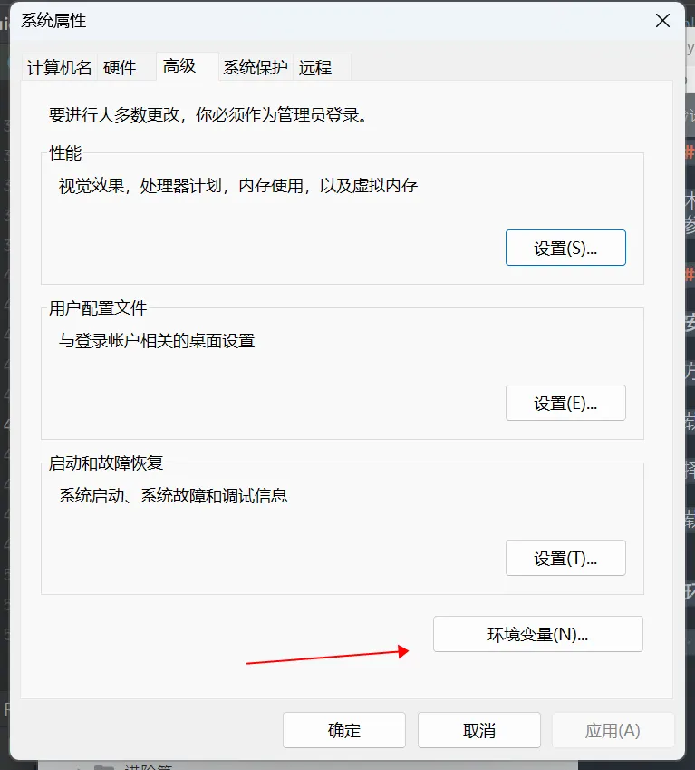

最小依赖jdk版本为8

## 手把手教你在Windows和macOS下安装JDK，菜逼也能掌握

win环境安装
* 安装包下载
* 官方下载主页: https://www.oracle.com/downloads/
* 下载地址: https://www.oracle.com/java/technologies/downloads/
* 选择需要的版本进行下载(下载.exe的安装包)
* 下载完毕之后，本地双击进行安装，请记录安装的路径，再下面的环境配置中需要用到！

环境配置

我的电脑 -> 右键 -> 属性 -> 高级系统设置 -> 环境变量

